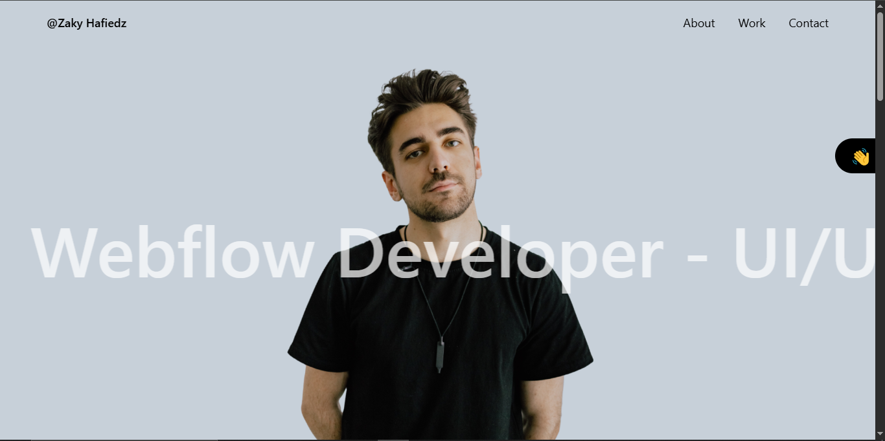

# This is repository for Exercise 4 Web Client Development(WCD)

This repository is intended to explore React + Typescript + Vite + Tailwind CSS. the project is build according to the provided UI design. [Figma reference](https://www.figma.com/design/rdUyThdkuA3XXuUwRYuGpN/intro-react?node-id=1-40&t=gvJVwDE6vY8NoNkR-0)




## How to Run Locally

Clone the project

```bash
  git clone https://github.com/ZaField/WCD03_Assignment4.git
```

Go to the project directory

```bash
  cd WCD03_Assignment4
```

Install dependencies

```bash
  npm install
```

Start the development

```bash
  npm run dev
```